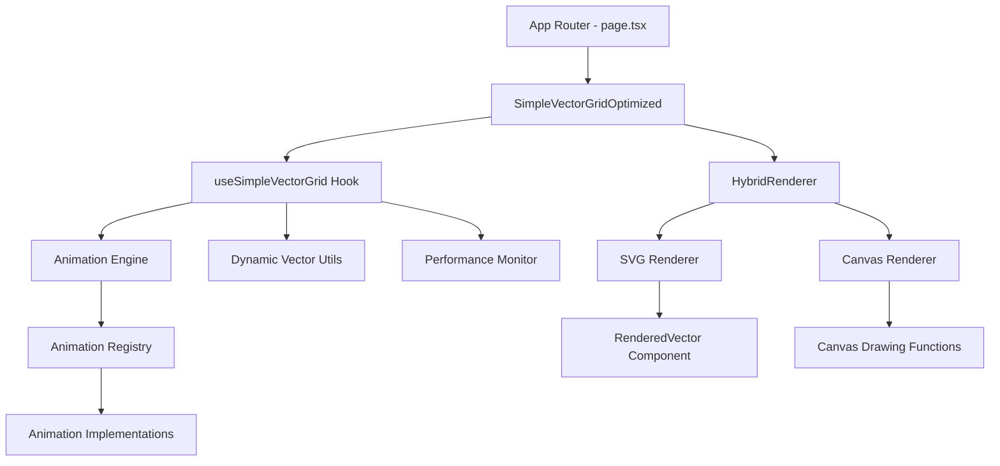
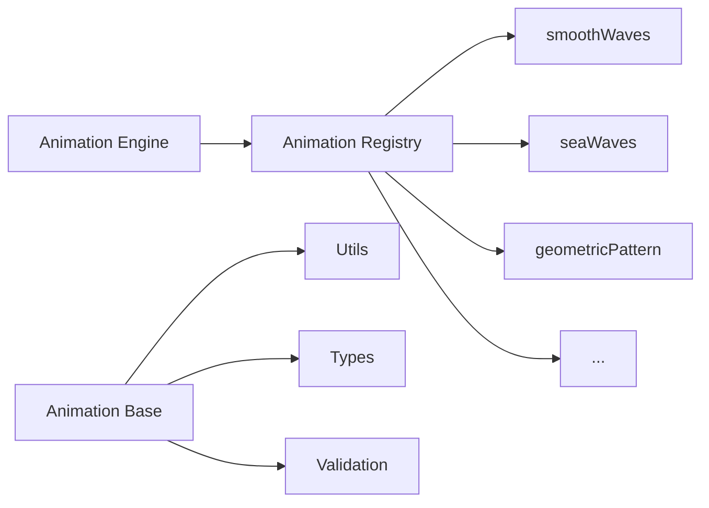
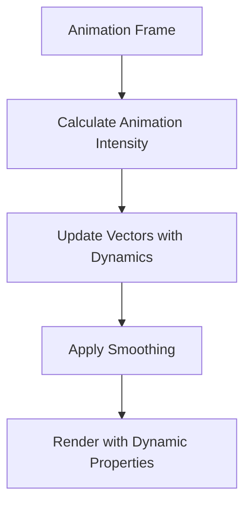
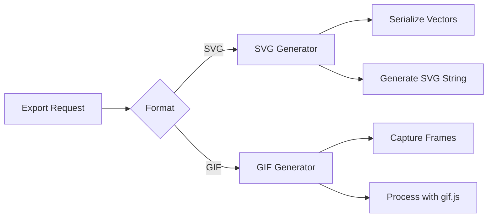

# Arquitectura del Sistema Flynn Vector Grid

## 📐 Visión General

Flynn Vector Grid está construido con una arquitectura modular que prioriza performance, escalabilidad y mantenibilidad. El sistema está diseñado para manejar desde grids pequeños (100 vectores) hasta masivos (5000+ vectores) con renderizado fluido.

## 🏗️ Arquitectura de Componentes



## 🎯 Componentes Principales

### 1. App Router (page.tsx)
**Responsabilidad:** Orquestación general y estado de la aplicación

- Gestión de configuraciones globales
- Estado de animaciones y props
- Controles de UI
- Coordinación entre componentes

**Estado clave:**
```typescript
- gridConfig: GridConfig
- vectorConfig: VectorConfig  
- currentAnimationId: string
- animationProps: Record<string, unknown>
- dynamicConfig: DynamicVectorConfig
```

### 2. SimpleVectorGridOptimized
**Responsabilidad:** Componente principal de renderizado con optimizaciones

- Gestión del ciclo de vida del grid
- Coordinación entre hook y renderer
- Propagación de configuraciones
- Manejo de eventos de interacción

**Props principales:**
```typescript
interface SimpleVectorGridOptimizedProps {
  gridConfig: GridConfig;
  vectorConfig: VectorConfig;
  animationType: AnimationType;
  animationProps: Record<string, unknown>;
  dynamicVectorConfig: DynamicVectorConfig;
  // ... más props
}
```

### 3. useSimpleVectorGrid Hook
**Responsabilidad:** Lógica de negocio y gestión de estado vectorial

**Funciones clave:**
- Generación inicial de vectores
- Aplicación de animaciones frame a frame
- Integración con sistema de longitud dinámica
- Optimizaciones de performance
- Manejo de refs y callbacks

**Estado interno:**
```typescript
interface VectorGridState {
  vectors: SimpleVector[];
  previousVectors?: SimpleVector[];
  isAnimating: boolean;
  lastFrameTime: number;
  pulseCenter?: { x: number; y: number; startTime: number };
  performanceMetrics: PerformanceMetrics;
}
```

### 4. HybridRenderer
**Responsabilidad:** Sistema de renderizado adaptativo SVG/Canvas

**Características:**
- Cambio automático de modo basado en performance
- Monitor de métricas en tiempo real
- Optimizaciones específicas por renderer
- Gestión de calidad adaptativa

**Modos de renderizado:**
```typescript
enum RenderMode {
  SVG = 'svg',     // < 300 vectores típicamente
  CANVAS = 'canvas' // > 300 vectores típicamente  
}
```

## 🎬 Sistema de Animaciones

### Arquitectura Modular



### Animation Engine
**Responsabilidad:** Coordinador central de animaciones

```typescript
// Flujo de ejecución
1. Recibe animationType y props
2. Valida y normaliza props usando validateProps()
3. Obtiene implementación desde registry
4. Aplica animación a vectores
5. Maneja errores y fallbacks
```

### Animation Registry
**Responsabilidad:** Registro de implementaciones disponibles

```typescript
export const animationRegistry = {
  smoothWaves: smoothWavesImpl,
  seaWaves: seaWavesImpl,
  geometricPattern: geometricPatternImpl,
  // ... más implementaciones
};
```

### Implementaciones de Animación
**Responsabilidad:** Lógica específica de cada tipo de animación

**Interfaz estándar:**
```typescript
interface AnimationImplementation {
  applyAnimation: (
    vectors: SimpleVector[], 
    props: AnimationProps, 
    time: number
  ) => SimpleVector[];
  
  getDefaultProps: () => AnimationProps;
  validateProps: (props: any) => AnimationProps;
}
```

## ⚡ Sistema de Performance

### Performance Monitor
**Responsabilidad:** Monitoreo y optimización automática

**Métricas rastreadas:**
```typescript
interface PerformanceMetrics {
  fps: number;
  renderTime: number;
  memoryUsage: number;
  complexity: number;
  vectorCount: number;
  shouldSwitchMode?: boolean;
}
```

**Algoritmo de decisión:**
```typescript
// Lógica de cambio de modo simplificada
if (vectorCount > 300 && fps < 30) {
  switchToCanvas();
} else if (vectorCount < 200 && renderTime < 16) {
  switchToSVG();
}
```

### Optimizaciones por Capa

#### Nivel de Animación
- Cache de cálculos costosos
- Pre-cálculo de constantes
- Eliminación de operaciones redundantes
- Normalización optimizada de ángulos

#### Nivel de Renderizado
- Memoización de props vectoriales
- Path2D para Canvas con muchos vectores
- Debounce de actualizaciones
- Pooling de objetos

#### Nivel de React
- React.memo en componentes críticos
- useMemo/useCallback estratégicos
- Refs para evitar re-renders
- Batching de actualizaciones de estado

## 🎛️ Sistema de Longitud Dinámica

### Arquitectura


### Flujo de Cálculo
```typescript
1. calculateAnimationIntensity() - Basado en cambio de ángulo
2. updateVectorWithDynamics() - Aplica configuración dinámica
3. applySmoothingToVector() - Suaviza transiciones
4. Renderizado usa dynamicLength || length
```

### Integración con Renderers
```typescript
// SVG Renderer
const actualLength = itemAny.dynamicLength ? 
  (itemAny.dynamicLength / resolvedBaseLength) : 1;

// Canvas Renderer  
length: vector.dynamicLength || vector.length
```

## 📤 Sistema de Exportación

### Arquitectura de Exportación


### SVG Generator
- Serialización de vectores a elementos SVG
- Preservación de animaciones
- Metadatos embebidos
- Optimización de tamaño

### GIF Generator  
- Captura de frames de animación
- Procesamiento con Worker
- Configuración de calidad
- Compresión optimizada

## 🔧 Patterns y Principios

### 1. Separation of Concerns
- **Presentación:** Componentes React
- **Lógica:** Custom hooks  
- **Estado:** Zustand stores (cuando necesario)
- **Render:** Renderers especializados

### 2. Strategy Pattern
- **Animaciones:** Intercambiables via registry
- **Renderizado:** SVG vs Canvas strategy
- **Exportación:** Múltiples formatos

### 3. Observer Pattern
- **Performance Monitor:** Observa métricas
- **Animation Engine:** Observa cambios de tiempo
- **Dynamic System:** Observa intensidad de animación

### 4. Factory Pattern
- **Vector Generation:** Factory para crear vectores
- **Animation Props:** Factory para props por defecto
- **Export Formats:** Factory para exportadores

## 🚀 Flujo de Renderizado

### Frame Pipeline
```typescript
1. requestAnimationFrame() triggered
2. useSimpleVectorGrid calculates new vector states
3. Dynamic system applies length/width modifications  
4. HybridRenderer determines optimal render mode
5. SVG or Canvas renderer draws vectors
6. Performance metrics updated
7. Next frame scheduled
```

### Optimización del Pipeline
- **Early exits** en animaciones sin cambios
- **Batching** de actualizaciones de estado
- **Throttling** de métricas de performance
- **Memoización** de cálculos costosos

## 📊 Escalabilidad

### Límites del Sistema
| Vectores | Modo Recomendado | FPS Esperado |
|----------|------------------|--------------|
| < 100    | SVG              | 60           |
| 100-300  | SVG              | 45-60        |
| 300-1000 | Canvas           | 30-45        |
| 1000+    | Canvas + Low Quality | 15-30   |

### Estrategias de Escalabilidad
1. **Rendering adaptativo** automático
2. **Calidad degradada** bajo carga
3. **Culling** de vectores fuera de viewport
4. **LOD (Level of Detail)** para vectores distantes

Esta arquitectura permite que Flynn Vector Grid mantenga alta performance mientras escala desde prototipos simples hasta visualizaciones complejas con miles de elementos animados.